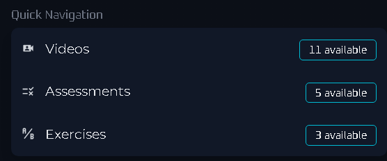
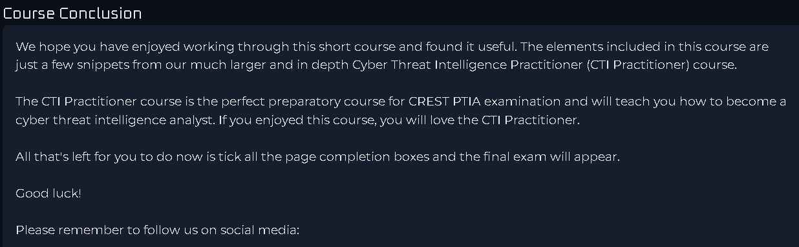
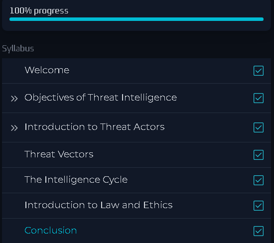

# 🧠 Cyber Threat Intelligence 101 – arcX

This repository documents my learning from the **Cyber Threat Intelligence 101** course offered by [arcX](https://arcx.io/). It includes structured notes, demo use cases, integration examples, screenshots, strategy frameworks, and certificate of completion.

---

## 🧠 Course Overview

This course explores foundational concepts in Cyber Threat Intelligence (CTI) with practical emphasis on:

- Threat actor profiling  
- IOC/IOA analysis  
- Threat data feeds and processing  
- Threat hunting integration  
- Strategic reporting and operational alignment

📚 **Link to Course**: [https://arcx.io/courses/cyber-threat-intelligence-101](https://arcx.io/courses/cyber-threat-intelligence-101)

---

## 📜 Certificate

- 🎓 [`Cyber Threat Intelligence 101 – arcX Certificate`](./cert/cti101-arcx-certificate.pdf)

---

## 📂 Repository Structure

| Folder              | Content Description                                           |
|---------------------|---------------------------------------------------------------|
| `notes/`            | Key takeaways & technical concepts covered in the course      |
| `demo/`             | Integration use cases, enrichment & threat detection examples |
| `intel-frameworks/` | Strategic CTI frameworks, modeling, prioritization            |
| `screenshots/`      | Visual summary of course progression                          |
| `LICENSE`           | AGPL v3.0 license                                             |
| `DISCLAIMER.md`     | Legal and ethical usage terms                                 |

---

## 📝 Notes

- [`intel-concepts.md`](./notes/intel-concepts.md) – Levels of intelligence, stakeholders, types  
- [`threat-actors.md`](./notes/threat-actors.md) – Classification, TTPs, campaigns  
- [`ioc-lifecycle.md`](./notes/ioc-lifecycle.md) – IOC types, detection, context

---

## 💻 Demo Use Cases

- [`siem-feed-integration.md`](./demo/siem-feed-integration.md) – Ingesting CTI feeds into SIEM  
- [`misp-integration-walkthrough.md`](./demo/misp-integration-walkthrough.md) – Practical MISP integration  
- [`enrichment-example.md`](./demo/enrichment-example.md) – IOC enrichment with public sources  

---

## 📊 Strategic & Operational Models

- [`diamond-model-in-practice.md`](./intel-frameworks/diamond-model-in-practice.md)  
- [`threat-hunting-alignment.md`](./intel-frameworks/threat-hunting-alignment.md)  
- [`cti-prioritization-layers.md`](./intel-frameworks/cti-prioritization-layers.md)

---

## 🖼️ Screenshots

| Description           | Screenshot |
|------------------------|------------|
| 📚 Course Navigation   |  |
| ✅ Final Review        |  |
| 🧠 Content Overview    |             |

---

## 📝 Course Review

This is one of the most focused CTI introductory courses available. It balances foundational theory with practical workflow guidance that can be integrated into threat hunting, SOC operations, or intelligence reporting.

✅ **What I liked**:
- Emphasis on structured CTI lifecycle and frameworks (e.g., Diamond Model)
- Integration examples with SIEM and MISP
- Clean UI and learner-friendly progression

📌 **To improve**:
- Could include more hands-on exercises or datasets
- Slightly expand coverage on malware analysis correlation

---

## ❗ Disclaimer

All content in this repository is for **educational purposes only**.  
By accessing or using any part of this repository, you agree to the following:

- You will **not** apply any technique or script on unauthorized systems.
- The author is **not responsible** for any misuse, damage, or legal consequences.
- You will **abide by ethical and legal standards** of cybersecurity practice.

See [`DISCLAIMER.md`](./DISCLAIMER.md) for full terms.

---

## ✍️ Author

**Thành Danh** – Pentester & Cybersecurity Research  

GitHub: [@ngvtdanhh](https://github.com/ngvtdanhh)  
Email: ngvu.thdanh@gmail.com

---

## 📄 License

This project is licensed under the **GNU AGPL v3.0**.  
See [`LICENSE`](./LICENSE) for full terms.

© 2025 ngvtdanhh. All rights reserved.
